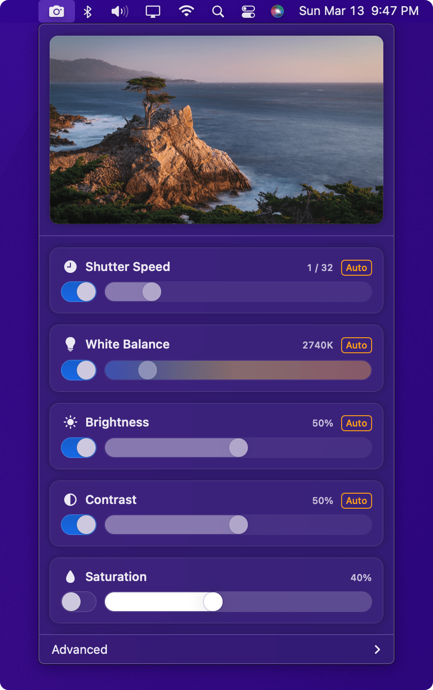

<h1 align="center">
  
  <br>
  Viewfinder 
  <br>
</h1>

<h4 align="center">A simple and convenient way to manage your webcam's picture settings, right from your menu bar.</h4>

<p align="center">
  <a href="https://github.com/lfroms/viewfinder/issues"></a>
  
  <a href="https://github.com/lfroms/viewfinder/stargazers"></a>
  <a href="https://github.com/lfroms/viewfinder"></a>
  
</p>

<p align="center">
  <a href="#about">About</a> •
  <a href="#getting-started">Getting Started</a> •
  <a href="#contributing">Contributing</a> •
  <a href="#license">License</a>
</p>

<p align="center">
  
</p>

## About

Viewfinder aims to provide a more native-feeling alternative to, let's face it, the mediocre apps provided by your webcam's manufacturer. Viewfinder lives in your menu bar, and looks and feels just like other system menu bar items, so you'll feel right at home.

Viewfinder is written in [SwiftUI](https://developer.apple.com/xcode/swiftui/), a declarative framework for building user interfaces for macOS.

> 📝 **Note:** Viewfinder is currently _beta software_, so it's possible that you'll run into issues. Many of these issues should begin to disappear once the codebase matures.

## Getting Started

To get started, you'll need to pull the source code. Find yourself a working directory, and clone this repo to it. I recommend using [GitHub Desktop](https://desktop.github.com).

Alternatively, pull it using the `git` CLI:

```sh
git clone https://github.com/lfroms/viewfinder.git
```

Then, navigate into the cloned repository:

```sh
cd viewfinder
```

You can then open the Xcode project (named `Viewfinder.xcodeproj`) in Xcode.

## Contributing

Viewfinder is open to contributions from the open source community. If you found a bug, feel free to open an issue and pull request if you know the fix! Thought of an improvement? Open a discussion, and once aligned, open a pull request with your changes.

## License

Viewfinder is released under the [GPL-3.0 License](LICENSE). However, source files that have not been forked from third party GPL-3.0 software may be made available under a less restrictive license upon request. License subject to change should the software cease to include GPL-3.0 code.
